.. Coloque dois pontos antes de uma frase para comentá-la

.. _estilo:

Estilo
======

No Power BI, é possível personalizar a aparência dos relatórios, como fundo da tela, botões, transparências, dentre
outros.

Nós disponibilizamos um tutorial de como customizar a aparência no
`seguinte link <https://coplin-ufsm.github.io/powerbi/data/outros/tutorial_adicionar_estilo.pdf>`_. Este tutorial também
está disponível na seção abaixo, mas pode ser difícil visualizar dependendo da tela do seu computador. Por isso,
recomendados acessar o tutorial no link acima.

Inserir plano de fundo
----------------------

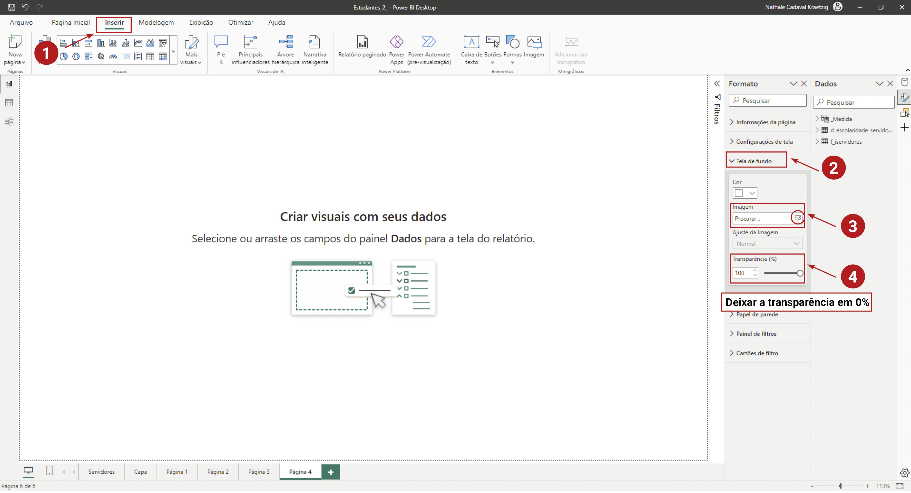

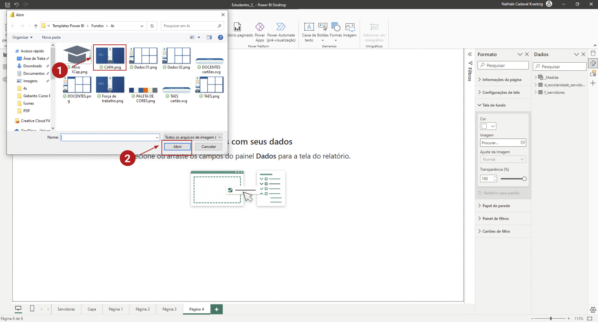

Após inserir a tela de fundo, é preciso ajustar seu tamanho, pois ela é adicionada com um tamanho maior que o da tela
de trabalho.

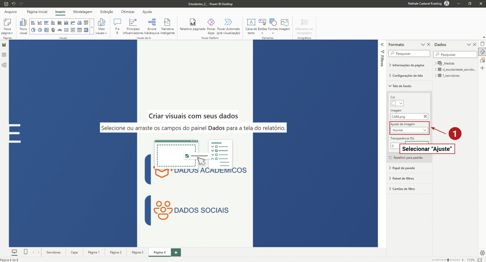

Criar nova página no relatório
------------------------------

Vamos adicionar uma nova página ao relatório para que possamos navegar em diferentes telas em um mesmo documento.

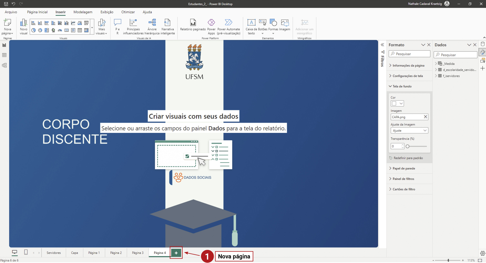

Inserir botão de navegação
--------------------------

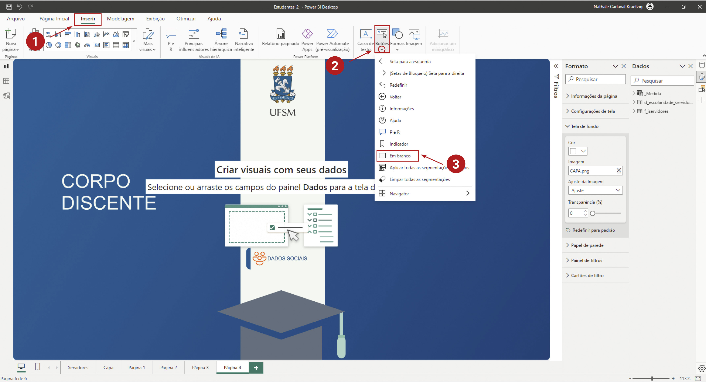

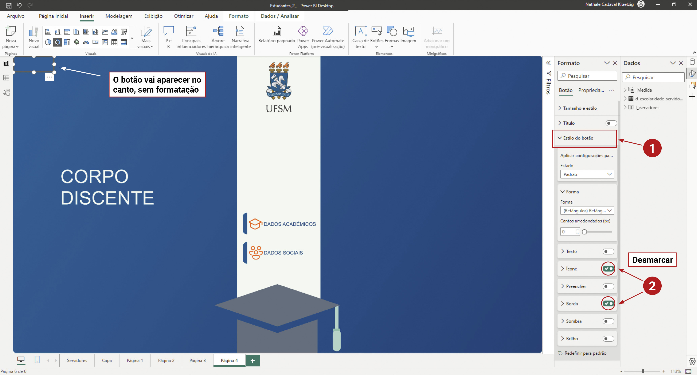

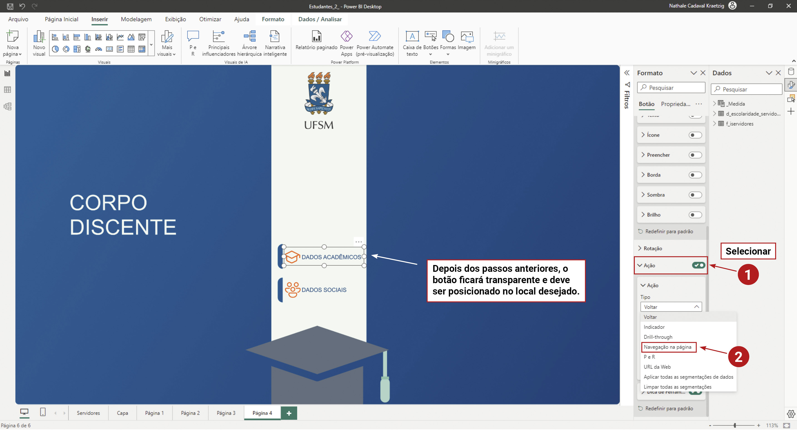

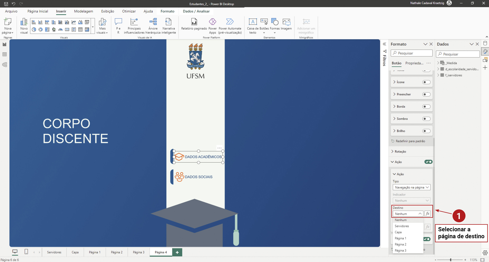

Inserir cartão
--------------

Esta ferramenta permite adicionar um cartão com fundo ajustável.

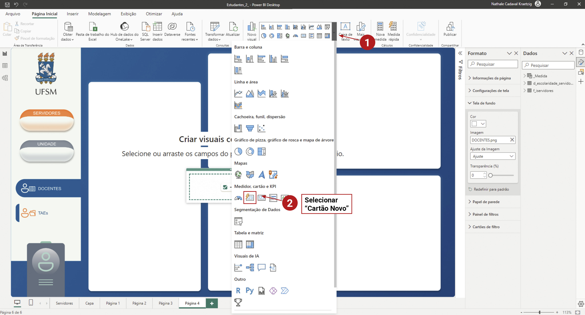

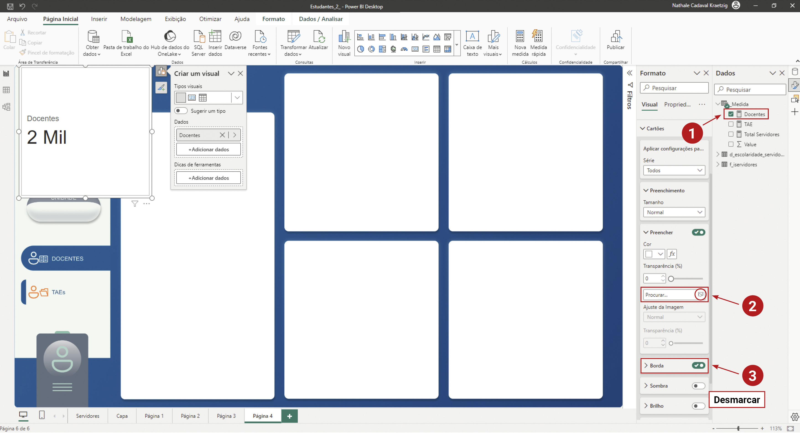

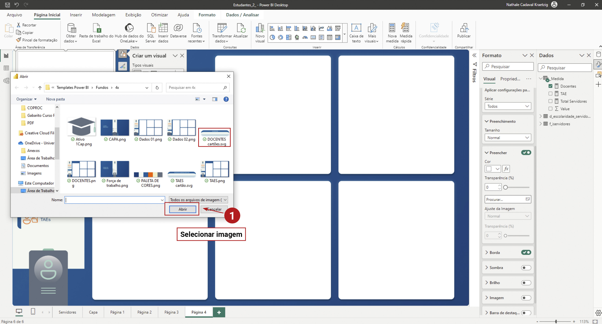

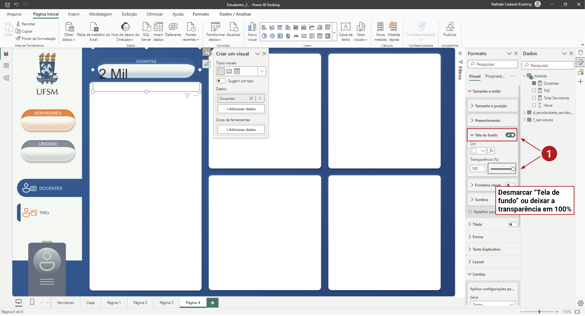

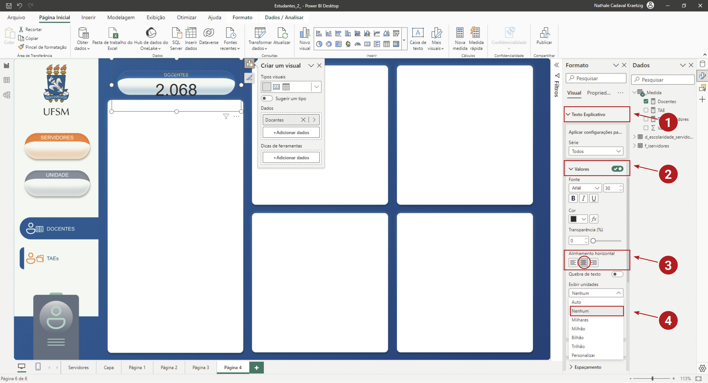

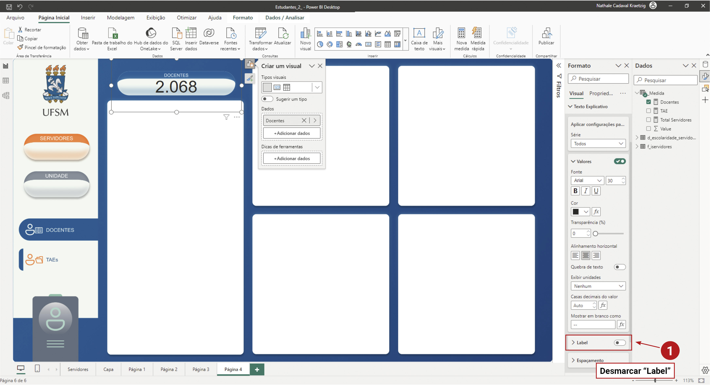

Material de apoio
-----------------

Também disponibilizamos um segundo passo-a-passo de como adicionar botões, cartões, e plano de fundo no material de
apoio, bem como um relatório do Power BI inicial e completo:

* `Tutorial <https://coplin-ufsm.github.io/powerbi/data/outros/tutorial_adicionar_estilo_2.pdf>`_
* `Relatório inicial <https://coplin-ufsm.github.io/powerbi/data/outros/Relatórios/Adicionando%20estilo%20(inicial).pbix>`_
* `Relatório final <https://coplin-ufsm.github.io/powerbi/data/outros/Relatórios/Adicionando%20estilo%20(final).pbix>`_
* `Plano de fundo <https://coplin-ufsm.github.io/powerbi/data/outros/Assets/Background/Fundo%20UFSM.svg>`_
* Cartões

  * `Cartão docentes <https://coplin-ufsm.github.io/powerbi/data/outros/Assets/Cartões/Cartão%20DOCENTES.svg>`_
  * `Cartão estudantes <https://coplin-ufsm.github.io/powerbi/data/outros/Assets/Cartões/Cartão%20ESTUDANTES.svg>`_
  * `cartão TAEs <https://coplin-ufsm.github.io/powerbi/data/outros/Assets/Cartões/Cartão%20TAES.svg>`_
* Ícones

  * `Ícone docente <https://coplin-ufsm.github.io/powerbi/data/outros/Assets/Ícones/Ícone%20DOCENTE.png>`_
  * `Ícone estudante <https://coplin-ufsm.github.io/powerbi/data/outros/Assets/Ícones/Ícone%20ESTUDANTE.png>`_
  * `Ícone TAE <https://coplin-ufsm.github.io/powerbi/data/outros/Assets/Ícones/Ícone%20TAE.png>`_
* `Tema UFSM <https://coplin-ufsm.github.io/powerbi/data/outros/Assets/Temas/Tema%20UFSM.json>`_
